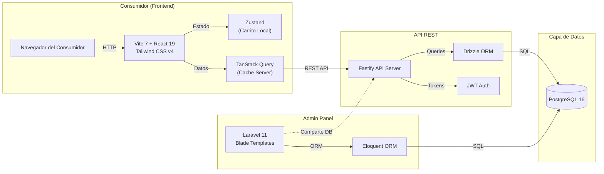
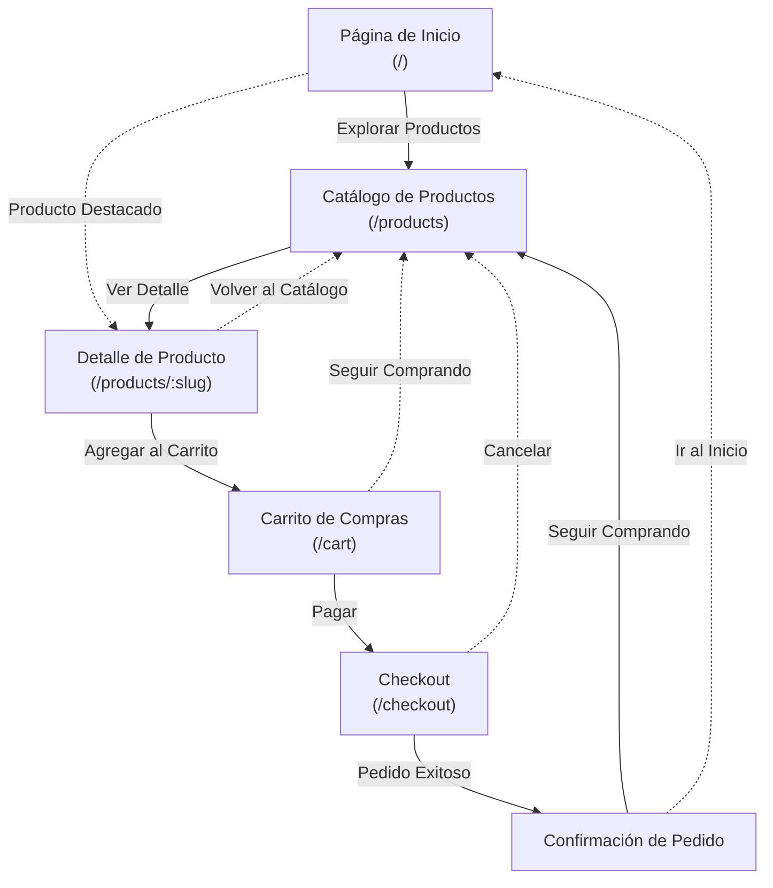
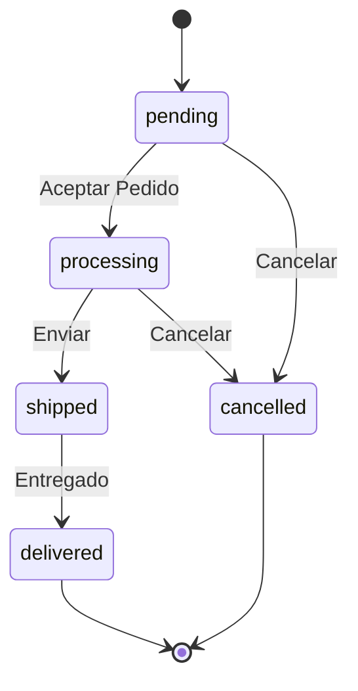
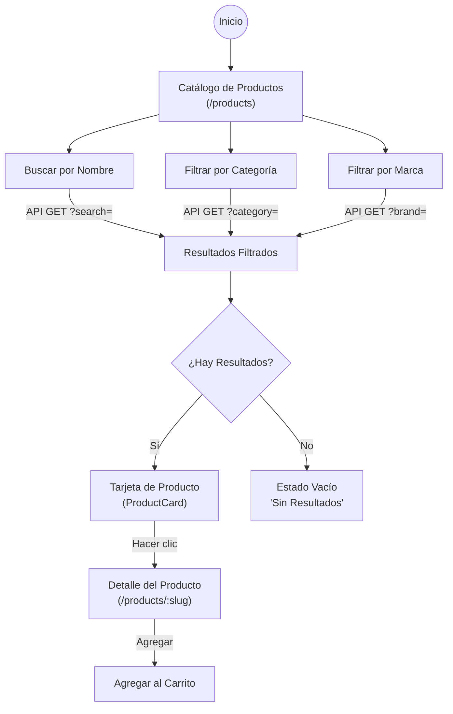
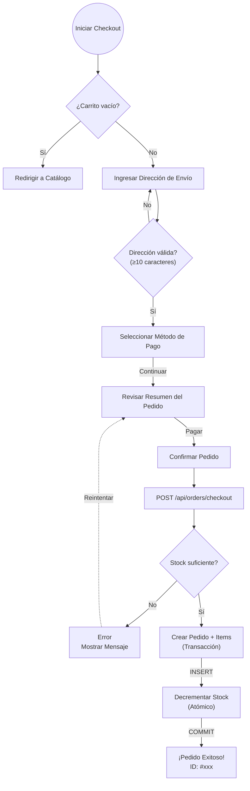

# ShopCart — Documentación del Proyecto

## Descripción General

ShopCart es una plataforma de comercio electrónico construida como monorepo con Turborepo. Permite a los consumidores explorar productos, gestionar un carrito de compras y realizar pedidos a través de una interfaz moderna y responsiva.

---

## Arquitectura del Sistema

| Capa | Tecnología | Puerto |
|------|-----------|--------|
| Frontend | Vite 7 + React 19 + TypeScript 5.9 + Tailwind CSS v4 | `localhost:5173` |
| API | Fastify + Drizzle ORM + PostgreSQL | `localhost:3000` |
| Admin | Laravel 11 + Blade + Eloquent | `localhost:8000` |
| Base de datos | PostgreSQL 16 | `localhost:5432` |



---

## Funcionalidades para el Consumidor

### 1. Página de Inicio (`/`)

La landing page presenta una experiencia de bienvenida completa:

- **Hero Slider**: Carrusel automático con 4 slides promocionales, flechas de navegación e indicadores de puntos
- **Productos Destacados**: Primeros 4 productos disponibles en un grid responsivo 2x4
- **Categorías**: Pills navegables que enlazan al catálogo filtrado por categoría
- **Productos en Oferta**: Productos con precio rebajado (compareAtPrice) y stock disponible
- **Tira de Confianza**: 4 señales de confianza (envío gratis >$99, devoluciones 30 días, pago seguro, stock en tiempo real)
- **Bloque CTA**: Banner de llamada a la acción final

### 2. Catálogo de Productos (`/products`)

Página de exploración completa con sistema de filtros:

- **Barra de Búsqueda**: Filtrado por nombre de producto (búsqueda ILIKE en API)
- **Filtro por Categoría**: Dropdown seleccionable con todas las categorías disponibles
- **Filtro por Marca**: Dropdown seleccionable con todas las marcas disponibles
- **Botón Limpiar Filtros**: Aparece cuando hay filtros activos
- **Contador de Resultados**: Muestra cantidad de productos encontrados
- **Grid de Productos**: Grid responsivo de 2-4 columnas con componentes `ProductCard`
- **Estado de Carga**: Skeleton shimmer con 8 placeholders
- **Estado de Error**: Mensaje de error con sugerencia
- **Estado Vacío**: Mensaje "Sin resultados" cuando no hay coincidencias

### 3. Detalle de Producto (`/products/:slug`)

Vista completa de un producto individual:

- **Breadcrumb**: Enlace de regreso al catálogo
- **Imagen del Producto**: Imagen completa con badge de descuento (si aplica)
- **Nombre de Marca**: Etiqueta en mayúsculas con color accent
- **Nombre del Producto**: Encabezado grande
- **Tag de Categoría**: Badge pill
- **Indicador de Precio**: Precio actual + precio tachado (compareAtPrice) + monto de ahorro
- **Indicador de Stock**: Color codificado (verde = disponible, ámbar = bajo stock <10, rojo = agotado)
- **SKU**: Código de identificación del producto
- **Descripción**: Sección expandible
- **Selector de Cantidad**: Botones +/- con límite de stock
- **Botón "Agregar al Carrito":** Muestra el total calculado para la cantidad seleccionada

### 4. Carrito de Compras (`/cart`)

Gestión completa del carrito de compras:

- **Estado Vacío**: Emoji + "Carrito vacío" + CTA para explorar productos
- **Lista de Items**: Cada item muestra imagen, nombre, precio, controles de cantidad (+/-), total por línea, botón de eliminar
- **"Seguir Comprando"**: Enlace de regreso al catálogo
- **Resumen del Pedido** (sidebar sticky): Subtotal, envío gratis, total, botón "Pagar" para checkout
- **Botón Vaciar Carrito**: En el header del carrito

### 5. Checkout (`/checkout`)

Proceso de pago dividido en dos paneles:

- **Guard de Carrito Vacío**: Redirige al catálogo si el carrito está vacío
- **Formulario de Dirección**: Textarea completo para dirección (mínimo 10 caracteres requeridos)
- **Selector de Método de Pago**: 3 tarjetas de opciones (tarjeta de crédito, tarjeta de débito, PayPal) con selección visual
- **Visualización de Errores**: Muestra mensajes de error de la API
- **Botón de Envío**: Muestra spinner de carga durante la mutación, display del total
- **Nota de Seguridad**: "Pago 100% seguro"
- **Resumen del Pedido** (sidebar sticky): Muestra cada item con imagen, nombre, cantidad, precio
- **Estado de Éxito**: Confirmación del pedido con ID, información de envío, botones CTA

### 6. Confirmación de Pedido

Después del checkout exitoso:

- **ID del Pedido**: Número de identificación único
- **Mensaje de Confirmación**: Detalles del pedido procesado
- **Opciones de Continuación**: Botones para seguir comprando o volver al inicio

---

## Características Técnicas del Frontend

### Estado del Carrito (Zustand)

- **Persistencia**: localStorage con key `'cart-storage'`
- **Middleware**: `devtools` > `persist` > `immer`
- **Acciones**: `addItem` (con límite de stock), `removeItem`, `updateQuantity` (elimina si es 0), `clearCart`
- **Selectores Derivados**: `useCartTotal()`, `useCartCount()`, `useClearCart()`
- **Consciencia de Stock**: La cantidad nunca excede el stock del producto

### Consultas de Datos (TanStack Query)

| Hook | Query Key | Datos |
|------|-----------|-------|
| `useProducts(filters)` | `['products', filters]` | `Product[]` |
| `useProduct(slug)` | `['product', slug]` | `Product` |
| `useCategories()` | `['categories']` | `Category[]` |
| `useBrands()` | `['brands']` | `Brand[]` |

- **Stale Time**: 5 minutos
- **Reintentos**: 1

### Animaciones

- **useInView**: Trigger de animación basado en IntersectionObserver para scroll
- **useScrollProgress**: Tracking del porcentaje de scroll para indicadores de progreso
- **Respeto**: `prefers-reduced-motion` del sistema

### Componentes Compartidos

| Componente | Propósito |
|-----------|-----------|
| `Layout` | Shell de la app con header sticky (logo, nav, icono carrito con badge), menú móvil hamburguesa, footer |
| `ProductCard` | Tarjeta reutilizable con imagen, badge descuento, categoría, nombre, marca, precio, indicador stock, botón agregar rápido |
| `ErrorBoundary` | Boundary de errores con UI de fallback y botón de recarga |
| `ProductCarousel` | Carrusel horizontal de productos con flechas de navegación |
| `FeaturesGrid` | Grid de 6 columnas con highlights de features |
| `SectionTitle` | Header reutilizable de sección con título y subtítulo |
| `HeroSlider` | Carrusel hero auto-rotativo con 4 slides |

### API Client

- **Base URL**: `/api` (proxy al backend Fastify)
- **Métodos**: `api.products.list()`, `api.products.get()`, `api.categories.list()`, `api.brands.list()`, `api.orders.checkout()`, `api.orders.get()`
- **formatPrice()**: Formatea como MXN (locale `es-MX`)
- **calcDiscount()**: Calcula porcentaje de descuento

---

## Endpoints de la API (Consumidor)

### Productos

| Método | Ruta | Descripción |
|--------|------|-------------|
| `GET` | `/api/products` | Listar productos con filtros opcionales: `?search=`, `?category=`, `?brand=` (por slug) |
| `GET` | `/api/products/:slug` | Obtener producto individual por slug (con relaciones brand y category) |

### Categorías

| Método | Ruta | Descripción |
|--------|------|-------------|
| `GET` | `/api/categories` | Listar todas las categorías |
| `GET` | `/api/categories/:slug` | Obtener categoría individual por slug |

### Marcas

| Método | Ruta | Descripción |
|--------|------|-------------|
| `GET` | `/api/brands` | Listar todas las marcas |
| `GET` | `/api/brands/:slug` | Obtener marca individual por slug |

### Pedidos

| Método | Ruta | Descripción |
|--------|------|-------------|
| `POST` | `/api/orders/checkout` | Crear pedido desde items del carrito (transaccional: valida stock, crea pedido + items, decrementa stock) |
| `GET` | `/api/orders/:id` | Obtener pedido por ID |

---

## Flujo del Consumidor (Resumen)



---

## Base de Datos

### Entidades Principales

| Entidad | Campos Clave | Relaciones |
|---------|-------------|------------|
| **Users** | id, name, email, password (hashed), role | — |
| **Brands** | id, name, slug, description, logo | — |
| **Categories** | id, name, slug, description, image, parent_id | Auto-referencial (jerárquica) |
| **Products** | id, name, slug, description, price, compare_at_price, sku, stock, images, is_active | brand_id → brands, category_id → categories |
| **Orders** | id, user_id, status, total, shipping_address | — |
| **Order Items** | id, quantity, price | order_id → orders (cascade), product_id → products (restrict) |

### Estados del Pedido



---

## Diagramas de Flujo Detallados

### Flujo de Exploración de Productos



### Flujo de Gestión del Carrito

```mermaid
flowchart LR
    subgraph local["Estado Local (Zustand + localStorage)"]
        add["Agregar Producto"]
        store["Almacenar en Carrito"]
        view_cart["Ver Carrito\n(/cart)"]
        update["Actualizar Cantidad"]
        remove["Eliminar Item"]
        clear["Vaciar Carrito"]
        summary["Resumen\nSubtotal + Envío + Total"]
        checkout["Ir a Checkout\n(/checkout)"]
    end

    add -->|addItem()| store
    store -->|Persistir| view_cart
    view_cart -->|+/- Cantidad| update
    view_cart -->|Eliminar| remove
    view_cart -.->|Vaciar Todo| clear
    update -->|Recalcular| summary
    remove -->|Recalcular| summary
    clear -->|Total = $0| summary
    summary -->|Pagar| checkout
```

### Flujo de Checkout



---

## Despliegue con Docker

### Servicios

| Servicio | Imagen | Puerto |
|----------|--------|--------|
| `db` | PostgreSQL 16 Alpine | `5432` |
| `api` | Fastify API | `3000` |
| `web` | Vite Frontend (nginx) | `5173` (host) / `80` (container) |
| `admin` | Laravel Admin | `8000` |

### Comandos

```bash
# Iniciar todos los servicios
docker compose up -d

# Ver logs
docker compose logs -f

# Detener servicios
docker compose down

# Fresh start (eliminar volúmenes)
docker compose down -v

# Rebuild después de cambios
docker compose build --no-cache
docker compose up -d
```

---

## Notas de Diseño

- **Idioma**: Español (todo el texto面向 al usuario está en español)
- **Moneda**: MXN (Peso Mexicano) via locale `es-MX`
- **Carrito**: Completamente del lado del cliente (Zustand + localStorage)
- **Autenticación**: JWT en API (endpoints `/api/auth/login` y `/api/auth/register`), pero el frontend NO usa autenticación actualmente
- **Color Accent**: Ember (#E85D04)
- **Tipografía**: Space Grotesk + DM Sans
- **Code Splitting**: Todos los componentes de página lazy-loaded via `React.lazy`
